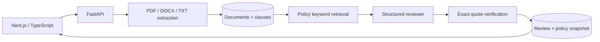

# Clause

A contract review workspace built as a focused legal document intelligence portfolio project. Upload a vendor agreement, configure procurement policy, and review structured findings with exact supporting passages. Fictional sample agreements are included.

## Run

Requires Node 22+ and Python 3.11+, or Docker Compose.

```sh
cp .env.example .env
docker compose up --build
```

Open http://localhost:3000. API documentation: http://localhost:8000/docs.

Without Docker, run `./scripts/dev.sh` on macOS/Linux or `./scripts/dev.ps1` on Windows. On Windows you can provide a Python executable with `-Python 'C:/path/to/python.exe'`. Local development defaults to SQLite; Docker uses Postgres with pgvector. Demo mode needs no credentials. Upload `fixtures/vendor-risky.txt` and click **Run policy review** to see five grounded deviations. Upload `vendor-compliant.txt` for the corresponding compliant cases.

Manual setup (two terminals):

```sh
cd backend
python -m venv .venv
# activate .venv using your shell's activation script
python -m pip install -e '.[dev]'
python -m uvicorn app.main:app --host 127.0.0.1 --port 8000
```

```sh
cd frontend
npm ci
npm run dev
```

For semantic analysis, set `ANALYSIS_PROVIDER=openai`, `OPENAI_API_KEY`, and optionally `OPENAI_MODEL` in the backend environment (or the root `.env` for Docker). The default model is `gpt-4.1-mini`. Uploads are sent to the configured provider only during an LLM review. Local shell runs do not automatically load `.env`; export the variables before starting the API. The frontend API URL is a build-time `NEXT_PUBLIC_API_URL` value.

## Architecture



- Preserve original bytes, SHA-256 digest, page provenance, headings and clause boundaries. TXT form feeds delimit pages. DOCX uses a single logical extracted document, not fabricated Word pagination. PDF requires a text layer; no OCR.
- Retrieve up to five relevant passages for each rule through ranked keyword frequency. A nullable `vector(1536)` column and pgvector extension are ready for future embeddings. This MVP does **not** claim vector or hybrid search.
- Pydantic validates policy rules and model findings. LLM calls use structured Responses output, bounded timeout/retries, and explicit treatment of contract text as untrusted evidence. Refusal or malformed output fails the review without saving partial results.
- Verify clause identity and normalized verbatim quotations against retrieved passages. Unsupported citations downgrade to `needs_review`. Exact grounding does not establish legal correctness.
- Persist original source, clauses, saved policies, completed reviews and immutable policy snapshots. Each run includes provider, model, pipeline version, and retrieved clause IDs.
- Demo reviewer recognizes only unchanged baseline rule instructions. It uses simple numeric/pattern comparisons and abstains for custom policy. It is intentionally a fixture demonstration, not a legal reasoning substitute.

## Validation

```sh
cd backend
python -m pytest -q
python evaluate.py
cd ../frontend
npm run typecheck
npm run build
```

The evaluation reports status accuracy, exact citation validity, and retrieval recall@5 on ten synthetic rule/document pairs. It fails on a baseline regression. Tests also cover forged citations, missing evidence, custom-policy abstention, page provenance, DOCX extraction, invalid uploads, and persisted API round trips. These small fixtures are regression checks, not an estimate of real contract accuracy. Set the LLM environment variables to evaluate the live provider explicitly; calls incur provider charges.

## Boundaries and next steps

This is a production-style **local MVP**, not a deployment-ready enterprise service. It has no authentication, tenant isolation, malware scanning, encrypted object storage, distributed job queue, audit access log or legal sign-off workflow. Run only on loopback with synthetic or approved documents. Docker ports bind to loopback. Reviews are synchronous and can take up to one provider request per policy rule. Do not expose the API publicly.

Uploads have a 10 MB limit, extracted text has a 1 MB limit, PDFs have a 200-page limit, and DOCX archives have a 30 MB decompressed-size guard. Policy and review creation use database transactions; parsing is bounded but not sandboxed. Schema creation is idempotent for initial setup; production schema evolution should use Alembic migrations. Credentials in Compose are development-only. Browser citation inspection is an extracted passage view rather than a PDF page overlay.

Next useful increments: expert-labeled ambiguous and adversarial evaluation cases; embeddings and hybrid retrieval benchmarks; durable review jobs with retry/idempotency; document deduplication; migrations; authentication and per-tenant access control; reviewer accept/reject states; OCR and PDF source overlays. There is no affiliation with Harvey.
