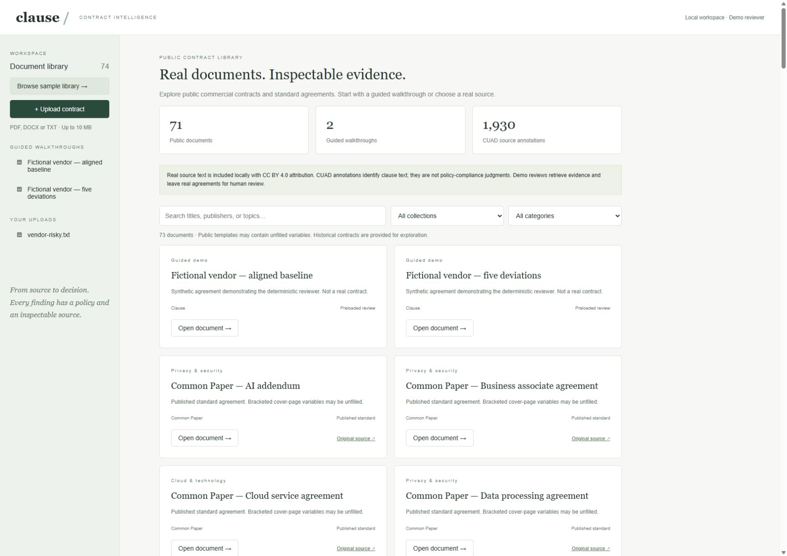
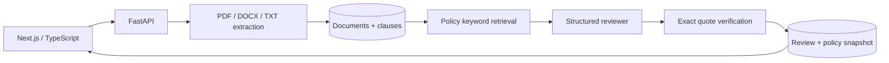

# Clause

A contract review workspace built as a focused legal document intelligence portfolio project. Upload a vendor agreement, configure procurement policy, and review structured findings with exact supporting passages. The offline demo includes **71 real public documents**, **1,930 CUAD source annotations**, and two fictional guided walkthroughs.



## Explore the demo

Startup seeds the bundled library automatically, once per database, without downloads or LLM calls. Browse and filter by collection and contract category, search titles and topics, and open a document. Every public sample includes attribution, a pinned source link, and a transformation notice.

- **11 Common Paper standards:** Mutual NDA, Cloud Service Agreement, DPA, SLA, Professional Services Agreement, AI Addendum, Business Associate Agreement, Software License Agreement, Pilot Agreement, Partnership Agreement, and Design Partner Agreement.
- **60 CUAD commercial contracts:** category-balanced historical contracts covering services, licensing, supply, distribution, confidentiality, marketing, franchise, partnerships and more. Explore attorney-supervised source excerpts in the **CUAD labels** tab and open the supporting source passage.
- **2 fictional walkthroughs:** a five-deviation agreement and an aligned baseline with preloaded deterministic reviews. These provide a quick demo without API credentials.
- **4 review playbooks:** procurement, privacy & AI, commercial diligence, and confidentiality. Customize the JSON instructions and keywords under Policy configuration.

All public snapshots are attributed under CC BY 4.0; see [source and licensing notes](samples/ATTRIBUTION.md). Public text is transformed or extracted text, with no invented original page numbers. CUAD source links point to the pinned dataset; original contract titles are retained for tracing filings.

In demo mode, **real public agreements always require review**. The application retrieves and verifies source evidence but does not run simplistic numeric checks to declare real contracts compliant. The fictional baseline examples retain the pattern reviewer. Configure OpenAI to run semantic policy analysis on a real document. Source annotations are labels, not compliance judgments.

## Run

For the prepared single-container online demo, see [deployment instructions](docs/DEPLOYMENT.md) and `render.yaml`. The public mode adds temporary visitor workspaces, same-origin API requests, bounded writes, and demo-only analysis. It is designed for public/fictional documents rather than durable customer workspaces.

Requires Node 22+ and Python 3.11+, or Docker Compose.

```sh
cp .env.example .env
docker compose up --build
```

Open http://localhost:3000. API documentation: http://localhost:8000/docs. The initial library contains 73 samples. Set `DEMO_SEED=false` to start an empty database instead. This flag does not delete already-seeded data.

Without Docker, run `./scripts/dev.sh` on macOS/Linux or `./scripts/dev.ps1` on Windows. On Windows you can provide a Python executable with `-Python 'C:/path/to/python.exe'`. Local development defaults to SQLite; Docker uses Postgres with pgvector. Demo mode needs no credentials. Upload `fixtures/vendor-risky.txt` and click **Run policy review** to see five grounded deviations. Upload `vendor-compliant.txt` for the corresponding compliant cases.

Manual setup (two terminals):

```sh
cd backend
python -m venv .venv
# activate .venv using your shell's activation script
python -m pip install -e '.[dev]'
python -m uvicorn app.main:app --host 127.0.0.1 --port 8000
```

```sh
cd frontend
npm ci
npm run dev
```

For semantic analysis, set `ANALYSIS_PROVIDER=openai`, `OPENAI_API_KEY`, and optionally `OPENAI_MODEL` in the backend environment (or the root `.env` for Docker). The default model is `gpt-4.1-mini`. Uploads are sent to the configured provider only during an LLM review. Local shell runs do not automatically load `.env`; export the variables before starting the API. The frontend API URL is a build-time `NEXT_PUBLIC_API_URL` value.

## Architecture



- Preserve original bytes, SHA-256 digest, page provenance, headings and clause boundaries. TXT form feeds delimit pages. DOCX uses a single logical extracted document, not fabricated Word pagination. PDF requires a text layer; no OCR.
- Retrieve up to five relevant passages for each rule through ranked keyword frequency. A nullable `vector(1536)` column and pgvector extension are ready for future embeddings. This MVP does **not** claim vector or hybrid search.
- Pydantic validates policy rules and model findings. LLM calls use structured Responses output, bounded timeout/retries, and explicit treatment of contract text as untrusted evidence. Refusal or malformed output fails the review without saving partial results.
- Verify clause identity and normalized verbatim quotations against retrieved passages. Unsupported citations downgrade to `needs_review`. Exact grounding does not establish legal correctness.
- Persist original source, clauses, saved policies, completed reviews and immutable policy snapshots. Each run includes provider, model, pipeline version, and retrieved clause IDs.
- Demo reviewer recognizes only unchanged baseline rule instructions. It uses simple numeric/pattern comparisons and abstains for custom policy. It is intentionally a fixture demonstration, not a legal reasoning substitute.

## Validation

```sh
cd backend
python -m pytest -q
python evaluate.py
python evaluate_public.py
cd ../frontend
npm run typecheck
npm run build
```

The fixture evaluation reports status accuracy, exact citation validity, and retrieval recall@5 on ten synthetic rule/document pairs. It fails on a baseline regression. Tests also cover forged citations, missing evidence, custom-policy abstention, page provenance, DOCX extraction, invalid uploads, persisted API round trips, corpus checksums and source offsets, and idempotent seeding. These small fixtures are regression checks, not an estimate of real contract accuracy. Set the LLM environment variables to evaluate the live provider explicitly; calls incur provider charges.

The public-corpus evaluation verifies all **1,930 annotation offsets** and measures lexical retrieval against eight CUAD labels across the 60 bundled contracts. Baseline answer recall@5 is **81.96% over 460 mappable answer excerpts**; 12 excerpts spanning parser passages are excluded. This subset and these queries are not held out, and the metric does not measure model comprehension or legal correctness. The complete per-label report is in [samples/evaluation.json](samples/evaluation.json). This harness makes retrieval misses visible rather than claiming production accuracy from fictional fixtures.

To reproduce the pinned public snapshots, run `python scripts/fetch_samples.py` from the repository root using the backend environment. The manifest records upstream commit IDs, licenses, source URLs, archive/document checksums, transformations and original CUAD titles. This maintenance command requires network access; normal demo startup does not.

## Boundaries and next steps

This is a production-style **local MVP**, not a deployment-ready enterprise service. It has no authentication, tenant isolation, malware scanning, encrypted object storage, distributed job queue, audit access log or legal sign-off workflow. Run only on loopback with synthetic or approved documents. Docker ports bind to loopback. Reviews are synchronous and can take up to one provider request per policy rule. Do not expose the API publicly.

Uploads have a 10 MB limit, extracted text has a 1 MB limit, PDFs have a 200-page limit, and DOCX archives have a 30 MB decompressed-size guard. Policy and review creation use database transactions; parsing is bounded but not sandboxed. Schema creation is idempotent for initial setup; production schema evolution should use Alembic migrations. Credentials in Compose are development-only. Browser citation inspection is an extracted passage view rather than a PDF page overlay.

Next useful increments: expert-labeled ambiguous and adversarial evaluation cases; embeddings and hybrid retrieval benchmarks; durable review jobs with retry/idempotency; document deduplication; migrations; authentication and per-tenant access control; reviewer accept/reject states; OCR and PDF source overlays. There is no affiliation with Harvey.
